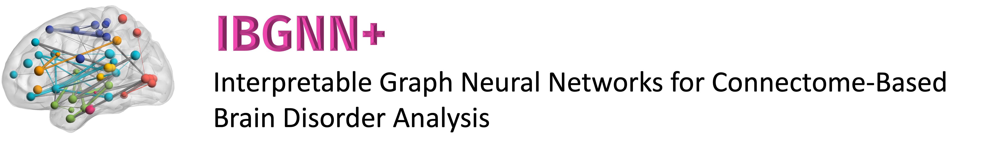

<p align="center">

</p>


This is the official implementation for the accepted MICCAI 2022 (Oral) paper [Interpretable Graph Neural Networks for Connectome-Based Brain Disorder Analysis](https://arxiv.org/abs/2207.00813). This framework consists of two modules: a brain network-oriented backbone prediction model and a globally shared explanation generator that can highlight disorder-specific biomarkers including salient Regions of Interest (ROIs) and important connections. The whole implementation is built upon [PyTorch](https://pytorch.org) and [PyTorch Geometric](https://pytorch-geometric.readthedocs.io/en/latest/).

---

# Specification of Dependencies

The framework needs the following dependencies:

```
torch~=1.10.2
numpy~=1.22.2
nni~=2.4
PyYAML~=5.4.1
scikit-learn~=1.0.2
networkx~=2.6.2
scipy~=1.7.3
tensorly~=0.6.0
pandas~=1.4.1
libsvm~=3.23.0.4
matplotlib~=3.4.3
tqdm~=4.62.3
torch-geometric~=2.0.3
h5py~=3.6.0
```

To install the dependencies, run:
```shell
pip install -r requirements.txt
```

The cuda version we used is 10.1. We installed torch through Conda (v4.11.0) with cuda support. 

# Folder Structure

This repository is organized into the following folders:

    - `./`: The main functions for backbone and explanation generator training.
    - `./models`: Models.
    - `./utils`: Utility functions.
    - `./analysis`: Visualizations and testing scripts.
    - `./baselines`: The baseline models and testing scripts.

# Running Instructions

To train our model on any of the datasets in our paper, simply run:
```shell
python main_explainer.py --dataset_name=<dataset_name> [--explain]
```

The `--dataset_name` is the name of the dataset you want to use. We tested it against the following datasets:

- HIV
- BP
- PPMI (Can be downloaded [here](https://www.ppmi-info.org/access-data-specimens/download-data))

Please place the dataset files in the `./datasets/` folder under the root folder. 

The `--explain` argument is optional. By passing `--explain`, the framework will trigger the explanation enhanced model `IBGNN+`. Otherwise, the framework will tests the backbone model `IBGNN`.

# Baselines

The four shallow baselines we included in our paper are in the `baselines/shallow` folder. 

To test the deep baseline models, run:

```shell
python main_explainer.py --dataset_name=<dataset_name> --model_name=<model_name>
```

Similarly, the `--dataset_name` is the name of the dataset to train the model on. The `--model_name` can be one of the following deep baselines:

- GCN
- GAT
- PNA

For the other two state-of-the-art deep baselines on brain networks, [BrainNetCNN](https://github.com/Wayfear/FBNETGEN/blob/main/model/model.py) and [BrainGNN](https://github.com/xxlya/BrainGNN_Pytorch), we use the publicly available implementation from their corresponding links.


# Citation

Please cite our paper if you find this code useful for your work:

```
@inproceedings{cui2022interpretable,
  title={Interpretable Graph Neural Networks for Connectome-Based Brain Disorder Analysis},
  author={Cui, Hejie and Dai, Wei and Zhu, Yanqiao and Li, Xiaoxiao and He, Lifang and Yang, Carl},
  booktitle={International Conference on Medical Image Computing and Computer-Assisted Intervention},
  pages={375--385},
  year={2022},
  organization={Springer}
}
```
